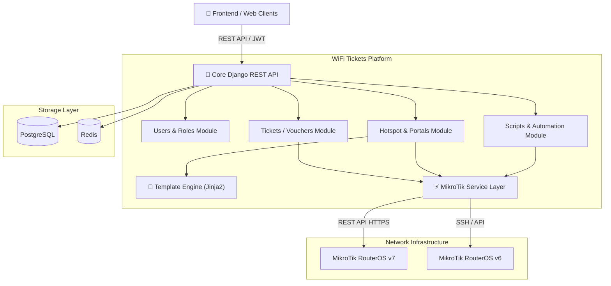

# WiFi Tickets API (Backend)

Centralized REST API for managing, selling, and controlling internet access through tickets/vouchers on **MikroTik RouterOS** devices, captive portal customization, and remote router administration.

---

## 🏛️ System Architecture

The system is built on a decoupled, modular architecture using Django and Django REST Framework, separating business logic from low-level network communication protocols:



### Design Principles
* **Hardware Decoupling:** The database maintains local state and auditing for tickets and profiles; the service layer synchronizes with routers asynchronously and resiliently without degrading the user experience.
* **Granular Access Control:** User-router associations based on roles (`Owner`, `Viewer`) for multi-tenant and multi-operator environments.
* **Portal Extensibility:** Built-in support for designing, previewing, and exporting vendor-ready captive portal packages in ZIP format.

---

## 🛠️ Technology Stack

| Category | Technology | Description |
| :--- | :--- | :--- |
| **Language & Core** | **Python 3.12+** / **Django 5** | Robust, secure foundation for the backend platform. |
| **API Framework** | **Django REST Framework (DRF)** | RESTful API design, serializers, and generic viewsets. |
| **Authentication** | **JWT (SimpleJWT)** | Stateless authentication with access and refresh tokens. |
| **Database** | **PostgreSQL** | Relational persistence for routers, users, tickets, and templates. |
| **Cache & Messaging** | **Redis** | High-performance caching and background task support. |
| **Templating & Rendering**| **Jinja2** | Dynamic rendering for captive portal pages and RouterOS scripts. |
| **Network Integration** | **Requests / Paramiko (SSH)** | HTTP REST integration for RouterOS v7 and SSH for RouterOS v6. |
| **API Documentation** | **drf-spectacular (OpenAPI 3)** | Automatic OpenAPI schema generation, Swagger UI, and ReDoc. |
| **Containerization** | **Docker & Docker Compose** | Reproducible development and production container environments. |

---

## 📦 System Modules

* **Routers (`apps/routers`):** MikroTik device registry, secure credential storage, connection status checks, and per-user role assignments.
* **Tickets (`apps/tickets`):** Batch generation of unique UUID access vouchers, expiration tracking, and bandwidth limit assignments.
* **Hotspot (`apps/hotspot`):** Synchronization of router profiles (`HotspotProfile`) and active users (`HotspotUser`), plus a captive portal designer with live web preview and ZIP bundle export.
* **Scripts (`apps/scripts`):** Parameterized script templates executed remotely on routers with execution tracking and output logs.
* **Users (`apps/users`):** Administrative accounts, permission management, and authentication flows.

---

## 🚀 Quickstart

### 1. Environment Setup
Copy the example configuration file:
```bash
cp .env.example .env
```

### 2. Run with Docker Compose (Recommended)
Start all services (PostgreSQL database, Redis, and the API):
```bash
docker compose up -d
docker compose exec api python manage.py migrate
```

### 3. Run Locally (Alternative with Makefile)
With PostgreSQL running and your virtual environment activated:
```bash
make install
make migrate
make run
```

---

## 📖 Interactive Documentation

Once the server is running, explore and test the endpoints via:

* **Swagger UI:** [http://localhost:8000/api/docs/](http://localhost:8000/api/docs/)
* **ReDoc:** [http://localhost:8000/api/redoc/](http://localhost:8000/api/redoc/)
* **Django Admin:** [http://localhost:8000/admin/](http://localhost:8000/admin/)
