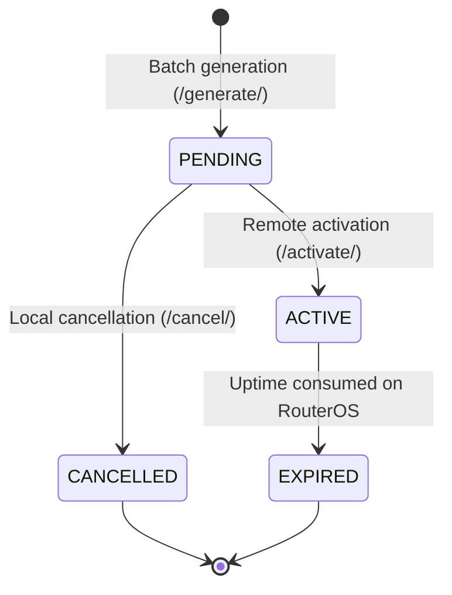

# Domain Specification: Tickets & Vouchers

* **Module:** `apps.tickets`
* **API Prefix:** `/api/tickets/`
* **Responsibility:** Batch generation of unique access codes (vouchers/tickets), ticket lifecycle tracking, remote hotspot user provisioning on MikroTik, and cancellation of unused vouchers.

---

## 1. Data Models & Entities

### Model `Ticket` ([apps/tickets/models.py](file:///home/carlos/Desktop/Personal/proyectos-personal/back_wifitickets/apps/tickets/models.py))
Represents a single-use or prepaid WiFi access voucher:
* **Access Code:** `code` (Immutable, globally unique UUIDv4).
* **Network Parameters:** `router` (FK), `profile_name` (Target MikroTik bandwidth profile), `duration_minutes` (*limit-uptime* duration in minutes).
* **Status:** Indexed `status` field defined in `Ticket.Status`:
  - `PENDING` (`pending`): Generated, not yet used.
  - `ACTIVE` (`active`): Provisioned on router, ready for hotspot login.
  - `EXPIRED` (`expired`): Uptime exhausted or manually expired.
  - `CANCELLED` (`cancelled`): Voided prior to activation.

---

## 2. Lifecycle & Business Rules

### State Machine Diagram



### Domain Invariants

1. **Strict Cancellation Invariant:**
   - Only tickets in `PENDING` status may be cancelled.
   - Attempting to cancel an `ACTIVE`, `CANCELLED`, or `EXPIRED` ticket is rejected with `HTTP 400 Bad Request`, code `invalid_status`, and localized message:
     ```json
     {
       "error": {
         "code": "invalid_status",
         "detail": "Only PENDING tickets can be cancelled. Current status: active"
       }
     }
     ```
2. **Hardware-Decoupled Batch Generation:**
   - Generating vouchers (`/api/tickets/generate/`) is purely a local database operation.
   - Causes zero network traffic or CPU load on the MikroTik router until activation time.
   - Batch quantity is strictly bounded between **1 and 500 tickets** per request.
3. **Activation & Remote Provisioning:**
   - Calling `/api/tickets/{id}/activate/` creates the user in `/ip/hotspot/user` on RouterOS, applying `profile` and `limit-uptime`.
   - The returned `mk_user_id` is recorded locally for auditing and session revocation.

---

## 3. Endpoints Catalog

| Method | Path | Permission | Description |
|---|---|---|---|
| `GET` | `/api/tickets/` | `IsAuthenticated` | Paginated ticket listing with router and status filters. |
| `GET` | `/api/tickets/{id}/` | `IsAuthenticated` | Retrieves detail of a single ticket. |
| `POST` | `/api/tickets/generate/` | `IsAuthenticated` | Batch generates 1 to 500 tickets with random UUIDs. |
| `POST` | `/api/tickets/{id}/activate/`| `IsAuthenticated` | Provisions user on router and transitions to `ACTIVE`. |
| `POST` | `/api/tickets/{id}/cancel/` | `IsAuthenticated` | Cancels a `PENDING` ticket, transitioning it to `CANCELLED`. |
| `DELETE`| `/api/tickets/{id}/` | `IsAuthenticated` | Deletes a ticket record from the local database. |

---

## 4. Test Traceability

| Test Sub-Domain | File | Key Scenarios Verified |
|---|---|---|
| **Batch Generation** | [apps/tickets/tests/test_generation.py](file:///home/carlos/Desktop/Personal/proyectos-personal/back_wifitickets/apps/tickets/tests/test_generation.py) | Successful batch creation in `PENDING`, rejection of out-of-bound quantities (`quantity: 0`). |
| **Cancellation** | [apps/tickets/tests/test_cancellation.py](file:///home/carlos/Desktop/Personal/proyectos-personal/back_wifitickets/apps/tickets/tests/test_cancellation.py) | Successful cancellation of `PENDING` ticket, guaranteed rejection of `ACTIVE` ticket cancellation. |
| **Internationalization** | [apps/tickets/tests/test_i18n.py](file:///home/carlos/Desktop/Personal/proyectos-personal/back_wifitickets/apps/tickets/tests/test_i18n.py) | Localized assertion in Spanish and English for invalid status cancellation rejection. |
