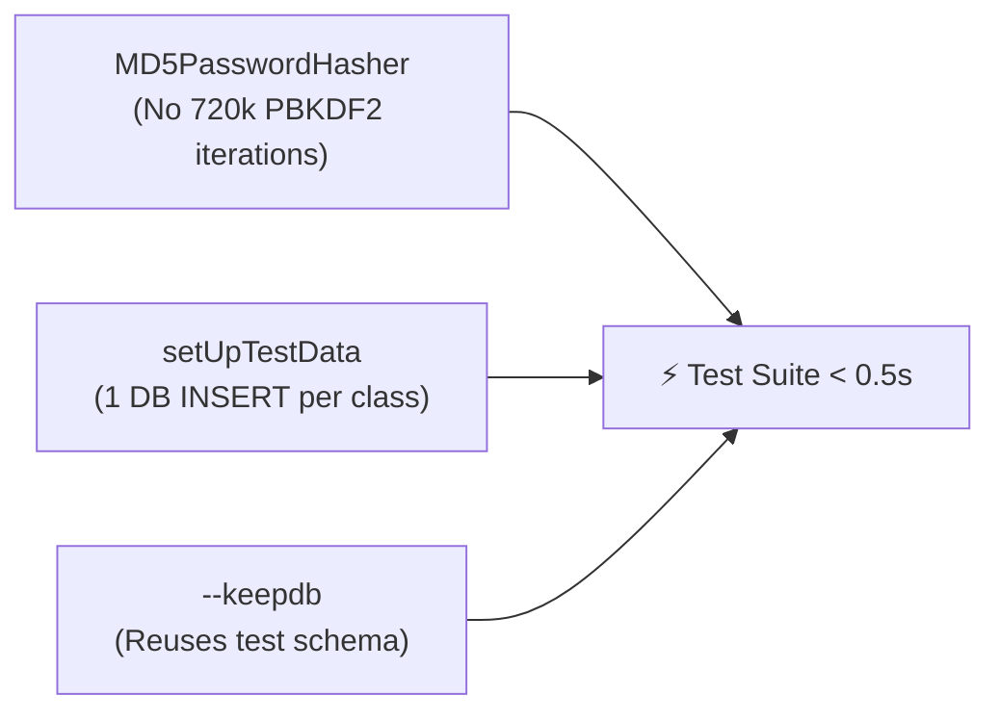

# Testing & Performance Guidelines

This guide establishes the architectural standards, sub-domain structuring, and performance best practices for the automated test suite of **WiFi Tickets**.

---

## 1. Testing Philosophy

1. **Sub-Second & Deterministic**: The entire test suite must execute in under **1 second**. Slow tests disincentivize frequent pre-commit validation.
2. **Sub-Domain Organization**: Monolithic `tests.py` files are strictly prohibited. Each test module must address a single functional responsibility.
3. **High Real-World Fidelity**: Tests assert against a real relational database (PostgreSQL in Docker), genuine DRF serializers, authentic JWT issuance, and real translation resolution.

---

## 2. Sub-Domain Architecture

Every application (`apps/<app>/`) organizes its test suite into an isolated `tests/` package:

```text
apps/<app>/tests/
├── __init__.py
├── test_<feature_a>.py        # Specific use case or functional sub-domain
├── test_<feature_b>.py        # Specific use case or functional sub-domain
└── test_i18n.py               # Internationalization tests (es/en) for the domain
```

### Naming Conventions:
* Modules **must** be prefixed with `test_` to ensure automatic discovery by Django's test runner (`manage.py test`).
* Suffixes must be semantic and self-explanatory (e.g., `test_registration.py`, `test_memberships.py`, `test_cancellation.py`).

---

## 3. The 3 Pillars of Test Performance

Applying these three pillars dropped test suite execution time from **16.2 seconds down to 0.47 seconds (~34x faster)**:



### Pillar 1: Class-Level Database Setup via `setUpTestData`
In standard Django `TestCase`, `setUp(self)` executes before **every single test method**. A test class with 5 methods creating a user and a router performs 5 database INSERT queries.

With `@classmethod def setUpTestData(cls)`:
* Django performs the database operations **once for the entire class** inside an atomic transaction.
* For each test method, Django establishes a savepoint and rolls back database modifications after the method completes.

```python
from rest_framework.test import APITestCase
from apps.routers.models import Router

class RouterPermissionsTests(APITestCase):
    @classmethod
    def setUpTestData(cls):
        """Runs exactly once for the entire test class."""
        cls.router = Router.objects.create(
            name="Protected Router",
            host="192.168.1.1",
            api_username="admin",
            api_password="password",
        )

    def setUp(self):
        """Runs before EACH test method (for authentication or in-memory refresh)."""
        self.router.refresh_from_db()  # Refresh if a test mutated in-memory attributes
```

### Pillar 2: Fast Hasher for Test Runs (`MD5PasswordHasher`)
Django's default PBKDF2 hasher uses **720,000 iterations** per password. In production this prevents brute-force attacks, but in tests where dozens of mock users are provisioned, 95% of test runtime is spent calculating hashes.

In [config/settings/base.py](file:///home/carlos/Desktop/Personal/proyectos-personal/back_wifitickets/config/settings/base.py):
```python
if "test" in sys.argv:
    PASSWORD_HASHERS = [
        "django.contrib.auth.hashers.MD5PasswordHasher",
    ]
```
> [!NOTE]
> `MD5PasswordHasher` preserves 100% of authentication functionality (`check_password`, `set_password`, JWT token claims) while hashing passwords in micro-seconds. It is conditionally active only when running tests.

### Pillar 3: Schema Persistence via `--keepdb`
In [Makefile](file:///home/carlos/Desktop/Personal/proyectos-personal/back_wifitickets/Makefile#L28):
```makefile
test:  ## Run test suite
	$(DJANGO_MANAGE) test apps/ --keepdb --verbosity=2
```
* Prevents destroying and re-creating PostgreSQL tables and migrations on every test run.
* New migrations are automatically applied on top of the preserved test schema.

---

## 4. Checklist for New Tests

When implementing a new endpoint or business rule:

- [ ] Is the test file placed in `apps/<app>/tests/test_<subdomain>.py`?
- [ ] Does the class inherit from `rest_framework.test.APITestCase`?
- [ ] Are persistent models created in `@classmethod def setUpTestData(cls)`?
- [ ] Is authentication configured in `setUp(self)` via `self.client.force_authenticate()`?
- [ ] Are both success cases (200/201) and failure cases (400/403/404) verified?
- [ ] Are localized error responses asserted in `test_i18n.py` with `HTTP_ACCEPT_LANGUAGE="es"` and `"en"`?
- [ ] Does the full test suite execute in under 1 second with `make test`?
